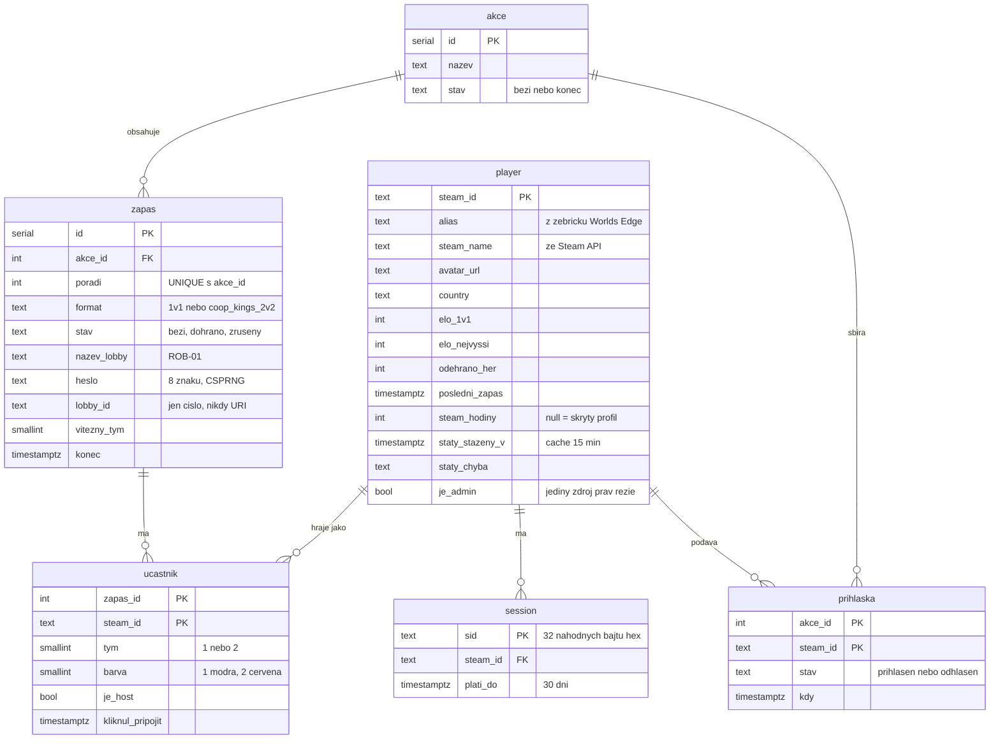
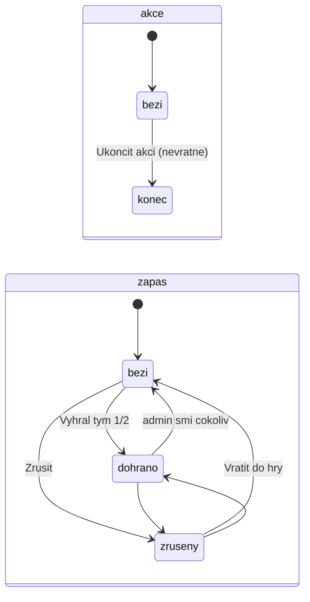
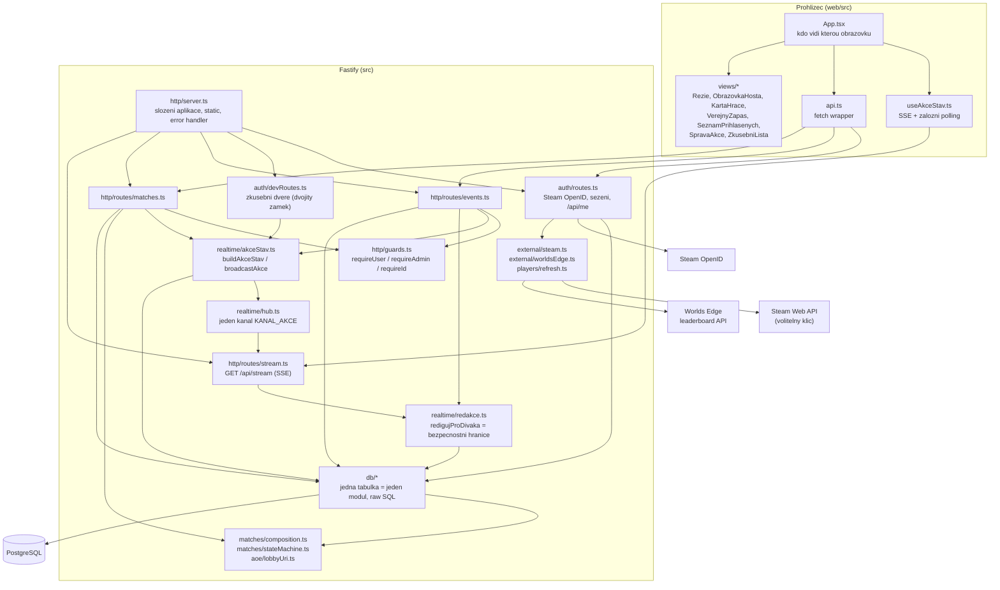
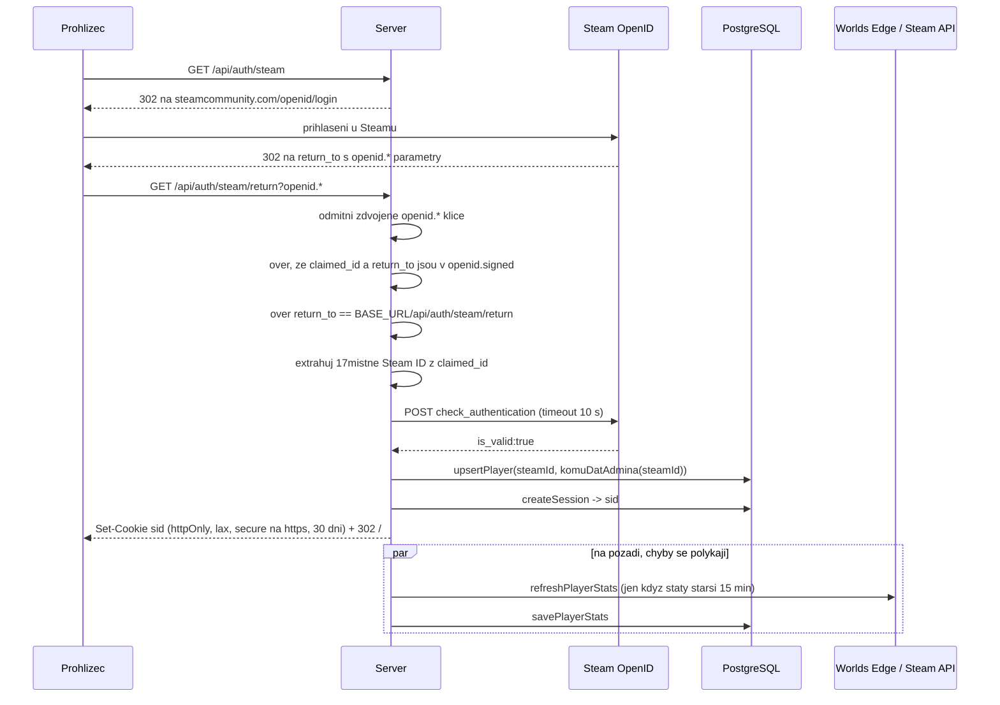
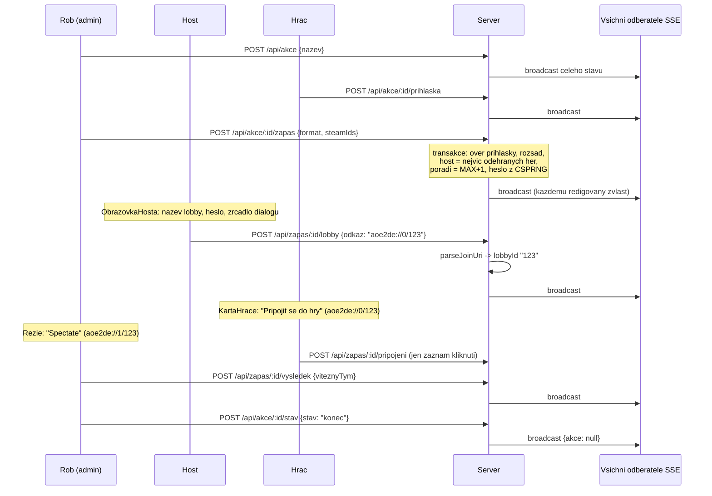

# Technická analýza projektu rob-aoe-web

*Stav ke commitu `0fe430a` (6. 9. 2026). Dokument vznikl čtením celého zdrojového kódu, migrací a existující dokumentace. Kde uvádí čísla, jsou spočítaná nebo naměřená nad tímto stavem repozitáře.*

Tenhle dokument doplňuje existující `README.md` (jak se web používá), `CONTRIBUTING.md` (jak to rozjet a o co nezakopnout) a `docs/nasazeni-u-roba.md` (ostrý provoz). Popisuje, **jak je systém poskládaný uvnitř**: architekturu, datový model, tok dat, API, bezpečnostní hranice, testy a nalezená rizika.

---

## 1. Shrnutí

| | |
|---|---|
| **Účel** | Web pro komunitní večery AoE2 DE streamera Robdiesalota: přihlášení přes Steam, skládání zápasů v režii, distribuce odkazů `aoe2de://` hráčům i divákovi (Spectate). |
| **Typ** | Monorepo se dvěma balíčky: Node backend (`src/`) a React frontend (`web/`). Sdílené typy přes relativní import, žádný mezibalíček. |
| **Backend** | Node 24+, TypeScript (ESM, `NodeNext`, `strict`, `noUncheckedIndexedAccess`), Fastify 5, `pg`. Bez ORM, bez auth knihovny. |
| **Frontend** | React 19, Vite 6, bez routeru a bez state-management knihovny. |
| **Databáze** | PostgreSQL (vyvíjeno na 17), 6 SQL migrací, vlastní migrátor. |
| **Realtime** | Server-Sent Events (SSE) s jedním kanálem a záložním pollingem. |
| **Autentizace** | Steam OpenID 2.0 (stateless), cookie sezení v DB. |
| **Rozsah kódu** | ~8 300 řádků TS/TSX/SQL/CSS včetně testů. |
| **Testy** | 141 hermetických backend + 113 databázových + 110 frontend. |
| **Nasazení** | Jeden Node proces obsluhuje API i statický frontend na `127.0.0.1:3000`, ven přes Cloudflare Tunnel. |

Projekt je malý, ale nezvykle disciplinovaný: skoro každý netriviální kus kódu má komentář „proč“, změny mají spec a plán v `docs/superpowers/`, a několik minulých chyb je zdokumentovaných jako pasti. Závislostí je záměrně minimum (4 runtime na backendu, 2 na frontendu).

Ověřeno na čistém klonu (Node 24.13.1): `npm install` obou balíčků, `tsc --noEmit` backendu, `tsc -b` frontendu, `npm test` (141 testů) a `npm run test:web` (110 testů) prošly. Databázové testy nebyly spuštěny (vyžadují databázi `*_test`).

---

## 2. Doménový model

### 2.1 Základní princip

Celý produkt stojí na jedné vlastnosti hry: AoE2 DE registruje protokol `aoe2de://` a dvě URI se liší jedinou číslicí.

```
aoe2de://0/<lobbyId>   připojí jako hráče
aoe2de://1/<lobbyId>   připojí jako diváka do téže lobby
```

Web ukládá **jen `lobbyId`** (textový sloupec `zapas.lobby_id`) a obě URI odvozuje při čtení v `src/aoe/lobbyUri.ts`. Host zápasu vloží odkaz z tlačítka Copy ve hře, server z něj vyparsuje číslo, a při každém sestavení stavu se z něj vyrobí `joinUri` pro hráče a `spectatorUri` pro Roba.

### 2.2 Entity



Tabulka `udalost` (audit log) z migrace 001 existuje, ale **nic do ní nezapisuje ani z ní nečte**. Tabulka `schema_migrations` patří migrátoru.

### 2.3 Invarianty vynucené databází

| Invariant | Kde |
|---|---|
| Nejvýš jedna otevřená akce (`stav <> 'konec'`) | částečný unikátní index `jedna_aktivni_akce` (migrace 003) |
| Pořadí zápasu je v rámci akce jedinečné | `UNIQUE (akce_id, poradi)` |
| Hráč je v zápase nejvýš jednou | `PRIMARY KEY (zapas_id, steam_id)` |
| Hráč má v akci jednu přihlášku | `PRIMARY KEY (akce_id, steam_id)`, upsert při opakovaném přihlášení |

Invarianty, které databáze **nevynucuje** a hlídá je jen kód: povolené hodnoty `stav` (žádný `CHECK`), právě jeden host na zápas, přesně jeden admin, počet účastníků odpovídající formátu.

### 2.4 Stavové automaty

Obojí bylo 5. 9. 2026 záměrně oškrtáno (spec `docs/superpowers/specs/2026-09-05-zjednoduseni-stavu-design.md`): každý stav navíc je klik, na kterém se dá v přímém přenosu zaseknout.



`canTransition(from, to)` v `src/matches/stateMachine.ts` dovoluje **každý přechod kromě přechodu na sebe sama**. Přechod se v DB zapisuje podmíněně (`WHERE stav = <ověřený stav>`), takže souběh dvou kliknutí skončí 409, ne tichým přepsáním.

„Lobby je založená“ není stav, ale odvozená vlastnost: `lobby_id IS NOT NULL`.

---

## 3. Architektura

### 3.1 Vrstvy



### 3.2 Adresářová mapa

| Cesta | Odpovědnost |
|---|---|
| `src/main.ts` | Vstupní bod: kontrola prostředí, varování do logu, start serveru, hodinový úklid sezení. |
| `src/config.ts` | Čtení `process.env`. Většina hodnot jsou gettery (čtou se při každém přístupu), aby šly testovat podstrčeným prostředím. |
| `src/http/server.ts` | `buildServer(deps)`: registrace rout, servírování `web/dist` s SPA fallbackem, jednotný error handler (`HttpError` → jeho kód, Fastify 4xx → propustit, ostatní → 500 + log). |
| `src/http/guards.ts` | `HttpError`, `requireUser`, `requireAdmin`, `requireId` (validace `:id` na rozsah integer). |
| `src/auth/` | `steamOpenId.ts` (čisté funkce pro OpenID), `routes.ts` (přihlášení, odhlášení, `/api/me`, `komuDatAdmina`), `devRoutes.ts` (zkušební dveře). |
| `src/db/` | `pool.ts` (lazy pool, `withTransaction`), `players.ts`, `sessions.ts`, `events.ts`, `matches.ts`, `chyby.ts` (detekce SQLSTATE 23505). |
| `src/realtime/` | `hub.ts`, `akceStav.ts`, `redakce.ts`. |
| `src/matches/` | `composition.ts` (rozsazení, výběr hosta, název lobby, heslo), `stateMachine.ts`. |
| `src/aoe/lobbyUri.ts` | Parsování a stavba `aoe2de://` URI. |
| `src/external/` | Klienti Steam Web API a Worlds Edge, odděleně čisté parsery a `fetch` volání. Fixtury v `fixtures/`. |
| `src/players/refresh.ts` | Orchestrace obnovy statistik, garance „nikdy nevyhodí výjimku“. |
| `src/shared/types.ts` | Typy payloadu sdílené s frontendem. |
| `web/src/` | `App.tsx`, `useAkceStav.ts`, `api.ts`, `zapas.ts` (filtry kdo co vidí), `format.ts`, `views/`. |
| `database/` | SQL migrace `001` až `006`. |
| `scripts/` | `migrate.ts` (migrátor), `copy-migrations.ts` (kopie SQL do `dist/`). |
| `docs/superpowers/` | Specifikace a implementační plány (proč to vzniklo takhle). |

### 3.3 Sestavení a běh

- `npm run dev` spouští `src/main.ts` přímo přes `--experimental-strip-types` s `--watch`; žádný build krok.
- `npm run build` = `tsc` (do `dist/`, s `rootDir: "."`, takže výstup je `dist/src/main.js`) → kopie migrací do `dist/database` → `tsc -b && vite build` ve `web/`. Řetěz přes `&&`: typová chyba ve frontendu zastaví `vite build` a `web/dist` zůstane starý.
- `npm start` spustí `dist/src/main.js`; server sám servíruje `web/dist`, pokud existuje.
- Server poslouchá **jen na `127.0.0.1`**. Veřejný přístup je vždy přes tunel nebo reverzní proxy.
- `.env` čtou jen `dev`, `start` a `db:migrate` (`--env-file-if-exists`). Testy ho záměrně nečtou.

---

## 4. Tok dat

### 4.1 Přihlášení přes Steam



Rozhodnutí o adminovi (`komuDatAdmina`): je-li `ADMIN_STEAM_ID` nastavené, rozhoduje jen ono a to i směrem dolů. Jinak s `ADMIN_BOOTSTRAP=true` dostane práva první přihlášený, dokud žádný admin neexistuje. Jinak se na `je_admin` nesahá (`null`).

### 4.2 Večer: založení akce, zápas, odkaz



### 4.3 Realtime: SSE s jedním kanálem

Principy, na kterých to stojí (a které se nesmí porušit):

1. **Vždy celý stav, nikdy přírůstky.** `broadcastAkce()` zavolá `buildAkceStav()` a publikuje kompletní `AkceStavPayload`. Klient nic neskládá, poslední zpráva je pravda. Díky tomu `GET /api/akce` vrací doslova týž payload a slouží jako plnohodnotná náhrada streamu.
2. **Jeden kanál (`KANAL_AKCE = 0`).** Klíčování podle id akce nic nepřinášelo (otevřená akce je nejvýš jedna) a rozbíjelo přechod mezi akcemi.
3. **Redakce těsně před odesláním, každému zvlášť.** Hub rozesílá neredigovaný payload, callback každého odběratele ho prožene přes `redigujProDivaka(payload, divak)`.

Detaily implementace `GET /api/stream` (`src/http/routes/stream.ts`):

- `close` posluchač se registruje jako první věc, ještě před prvním `await`, jinak by odběratel unikal.
- `reply.hijack()` a vlastní hlavičky (`text/event-stream`, `x-accel-buffering: no`).
- Odběr v hubu vzniká **před** sestavením úvodního stavu; zprávy doručené mezitím se schovají a pošlou až po úvodním snímku (jinak by starší stav přepsal novější).
- Puls `: puls` každých 25 s drží spojení naživu.
- Bez běžící akce se stream neodmítá, pošle `{akce: null, ...}`.

Klient (`web/src/useAkceStav.ts`) drží dvě zábradlí:

| Situace | Reakce |
|---|---|
| Spojení spadne (`onerror`) | Klient `EventSource` sám zavře a znovu otevře s exponenciálním odkladem 1 s → 15 s. Nespoléhá na vestavěný reconnect, který po ne-200 skončí natrvalo. |
| Spojení je otevřené, ale 5 s mlčí | Zapne polling `GET /api/akce` každé 3 s. Stream nezavírá; první doručená SSE zpráva polling vypne. |

Druhý případ není teoretický: bezplatný Cloudflare quick tunnel (`*.trycloudflare.com`) SSE bufferuje až do konce odpovědi. Přes něj web funguje v pollingovém režimu.

### 4.4 Kdo co vidí (redakce)

`redigujZapas` v `src/realtime/redakce.ts`:

| Divák | `heslo` | `lobbyId` | `joinUri` | `spectatorUri` |
|---|---|---|---|---|
| admin | ano | ano | ano | ano |
| účastník zápasu | ano | ano | ano | `null` |
| kdokoliv jiný (i anonym) | `""` | `null` | `null` | `null` |

Sestava (jména, týmy, barvy, stav, výsledek) je veřejná pro všechny včetně nepřihlášených. Frontend pak rozhoduje o obrazovce v `App.tsx` a `web/src/zapas.ts`:

- `mojeZapasy`: běžící zápasy, ve kterých hraju → `ObrazovkaHosta` (jsem host) nebo `KartaHrace`.
- `verejneZapasy`: všechno ostatní kromě zrušených → řádek `VerejnyZapas`; sem spadnou i vlastní dohrané zápasy, aby hráči po zapsání výsledku nezmizely.
- Admin navíc vidí `SpravaAkce` (i bez běžící akce, jinak by ji neměl jak založit) a `Rezie`.

**Poznámka z historie projektu:** server posílal zápas všem správně, ale frontend ho dvěma filtry zahodil. Při změně viditelnosti je nutné ověřit obě strany.

### 4.5 Statistiky hráčů

`refreshPlayerStats` (`src/players/refresh.ts`) stahuje paralelně tři zdroje a **nikdy nevyhodí výjimku** (dílčí selhání jdou do `staty_chyba`, totální selhání se zkusí zapsat také):

| Zdroj | Co dává | Klíč |
|---|---|---|
| Worlds Edge `getPersonalStat` (žebříček 3 = 1v1 RM) | alias, země, ELO, nejvyšší ELO, výhry+prohry, poslední zápas | ne |
| Steam `GetPlayerSummaries` | jméno na Steamu, avatar | ano |
| Steam `GetOwnedGames` (appid 813780) | odehrané hodiny; `null` = skrytý profil, `undefined` = nevíme (bez klíče, nesahat) | ano |

Cache 15 minut podle `staty_stazeny_v`. Bez `STEAM_API_KEY` se Steamu neptá vůbec, aby se prázdný klíč (403) nezapsal každému jako varování.

---

## 5. HTTP API

Všechny odpovědi jsou JSON. Chyby mají tvar `{ "chyba": "česká věta" }`. Auth je cookie `sid`.

### 5.1 Veřejné a přihlašovací

| Metoda | Cesta | Práva | Popis |
|---|---|---|---|
| GET | `/api/health` | žádná | `{ok: true}` |
| GET | `/api/auth/steam` | žádná | 302 na Steam OpenID |
| GET | `/api/auth/steam/return` | žádná | Návrat ze Steamu, založí sezení, 302 na `/`. 401 při jakémkoliv podezření. |
| POST | `/api/auth/logout` | žádná | Smaže sezení a cookie |
| GET | `/api/me` | žádná | `{hrac: PlayerRow nebo null}` (obsahuje `jeAdmin`) |
| GET | `/api/akce` | žádná | Redigovaný `AkceStavPayload`, totéž co SSE |
| GET | `/api/stream` | žádná | SSE, `data: <AkceStavPayload>` při každé změně |

### 5.2 Akce

| Metoda | Cesta | Práva | Tělo | Chyby |
|---|---|---|---|---|
| POST | `/api/akce` | admin | `{nazev}` | 400 prázdný název, 409 ještě běží jiná akce |
| POST | `/api/akce/:id/stav` | admin | `{stav: "bezi" nebo "konec"}` | 400 neznámý stav |
| POST | `/api/akce/:id/prihlaska` | user | žádné | 409 akce neběží nebo není aktivní |
| DELETE | `/api/akce/:id/prihlaska` | user | žádné | odhlášení zapíše `stav='odhlasen'`, řádek zůstává |

### 5.3 Zápasy

| Metoda | Cesta | Práva | Tělo | Chyby |
|---|---|---|---|---|
| POST | `/api/akce/:id/zapas` | admin | `{format, steamIds[]}` | 400 formát/počet/duplicita, 409 hráč se odhlásil nebo souběh pořadí. Vrací jen `{zapas: {id}}`. |
| POST | `/api/zapas/:id/stav` | admin | `{stav}` | 400 neznámý, 404, 409 zakázaný přechod nebo souběh |
| POST | `/api/zapas/:id/lobby` | admin nebo host | `{odkaz: "aoe2de://0/<id>"}` | 400 s konkrétní hláškou (prázdné / divácký odkaz / špatný tvar), 403, 409 zápas dohraný nebo zrušený |
| POST | `/api/zapas/:id/host` | admin | `{steamId}` | 400 není účastník. **Vynuluje `lobby_id`.** |
| POST | `/api/zapas/:id/pripojeni` | účastník | žádné | 403 nehraje. Jen zapíše časové razítko kliknutí. |
| POST | `/api/zapas/:id/vysledek` | admin | `{viteznyTym: 1 nebo 2}` | 400. Zapíše vítěze a přepne na `dohrano`, pokud tam už není. |

### 5.4 Zkušební dveře (`/api/dev/*`)

Registrují se jen s `DEV_PRISTUP=true` a **navíc** odmítají obsluhovat (404), jakmile `BASE_URL` začíná `https://`. Všechny odpovídají přesměrováním, aby fungovaly jako odkazy.

| Cesta | Popis |
|---|---|
| GET `/api/dev/hraci` | Podklad pro lištu na stránce: seznam zkušebních jmen, režisér, skutečné účty, aktuální admin. |
| GET `/api/dev/login?jmeno=Pepa` nebo `?steamId=…` | Přihlásí bez Steamu. Zkušební účty mají ID `test:<jmeno>`, které skutečné Steam ID nikdy mít nemůže. Na práva admina nesahá. |
| GET `/api/dev/rezie?steamId=…` | Předá režii jedním příkazem `UPDATE player SET je_admin = (steam_id = $1)`. |
| GET `/api/dev/naplnit?pocet=3` | Přihlásí do akce N ze šesti pevných zkušebních hráčů (idempotentní). |

---

## 6. Bezpečnost

### 6.1 Co je uděláno dobře

- **Steam OpenID je ověřený pečlivě.** Návratová routa odmítá zdvojené `openid.*` klíče (obchází `URLSearchParams.get`, který vrací první), vyžaduje `claimed_id` i `return_to` v `openid.signed`, kontroluje, že `return_to` míří na tento web (jinak by prošla assertion z jakéhokoliv jiného webu se Sign in with Steam), a `is_valid` parsuje po řádcích (obrana proti injekci přes `invalidate_handle`). Surový query string se čte z `request.raw.url`, protože Fastify by zdvojené klíče slil.
- **Sezení:** 32 náhodných bajtů, uložené v DB s expirací, cookie `httpOnly`, `sameSite=lax`, `secure` na https. Hodinový úklid expirovaných.
- **Autorizace na serveru,** ne v UI: `requireAdmin` čte `je_admin` z DB při každém požadavku, `roleVZapase` ověřuje hosta proti tabulce `ucastnik`.
- **Tajemství tečou jediným místem** (`redigujProDivaka`); admin akce vracejí jen `{id}`, nikdy heslo.
- **Parametrizované SQL všude,** žádná konkatenace uživatelských hodnot. `requireId` odmítá hodnoty mimo rozsah integer.
- **Heslo lobby z CSPRNG** (`crypto.randomInt`), ne z `Math.random`.
- **Timeouty na všech externích voláních** (10 s).
- **Zkušební dveře mají dvojitý zámek** a testuje se, že přes https vrací 404.
- **Chybové hlášky nevyzrazují stack**; 500 loguje na server a klientovi říká jen obecnou větu.
- Server poslouchá jen na loopbacku.

### 6.2 Na co dát pozor

| Riziko | Závažnost | Poznámka |
|---|---|---|
| **Divák se pro SSE určuje jednou při připojení.** Změna práv (předání režie, odebrání admina) se u už otevřeného streamu projeví až po reconnectu. | nízká | V praxi se práva mění jen ve vývoji; po `/api/dev/rezie` stránka přesměruje a reconnectne, ale **druhé okno** drží starou redakci. |
| **Stavové GET routy pod `/api/dev/`.** Cookie `lax` se na top-level GET navigaci posílá, takže cizí stránka může na localhostu vyvolat `/api/dev/rezie` odkazem. | nízká | Jen ve vývoji na http; přes https jsou zavřené. |
| **Bez rate limitu.** Přihlášení (volá Steam) ani `/api/akce` polling nejsou omezené. | nízká | Publikum je desítky lidí; polling 3 s × N klientů je při výpadku SSE nejvyšší zátěž. |
| **`ADMIN_BOOTSTRAP` bez `ADMIN_STEAM_ID`:** kdo drží adresu, drží režii, dokud admin neexistuje. | střední | Zdokumentované, server varuje při startu. Pro ostrý provoz vždy vyplnit `ADMIN_STEAM_ID`. |
| **Steam API klíč v URL** odchozích požadavků. | nízká | Standard Steam API; nikam se neloguje. |
| **Žádná CSRF ochrana kromě `sameSite=lax`.** | nízká | Pro POST s JSON tělem je `lax` dostatečné (cross-site POST cookie nenese). |

---

## 7. Testy a kvalita

### 7.1 Rozdělení

| Sada | Příkaz | Počet | Co pokrývá |
|---|---|---|---|
| Hermetické backend | `npm test` (`*.test.ts`) | 141 | Parsery URI, OpenID funkce, sestava, stavový automat, hub, redakce, refresh statistik, parsery externích API s fixturami, config, error handler serveru. |
| Databázové | `npm run test:db` (`*.db.test.ts`) | 113 | Každý DB modul, každá routa přes `app.inject`, SSE stream včetně souběhů a úklidu, zkušební dveře, přihlašovací routa s podstrčeným Steamem. |
| Frontend | `npm run test:web` (`*.test.tsx`, jsdom) | 110 | Každá obrazovka, `useAkceStav` (reconnect, polling, vypnutí pollingu), `App` (kdo co vidí), filtry v `zapas.ts`. |

Databázové testy volají `TRUNCATE`; `vitest.db.setup.ts` odmítne běžet, pokud jméno databáze v `DATABASE_URL` nekončí na `_test`.

### 7.2 Co chybí

- **End-to-end test** skutečné cesty člověka (prohlížeč → server → DB). Autor sám uvádí, že zelené testy propustily vady viditelné na první pohled.
- Test integrace se skutečným Steamem není možný; OpenID je pokryté fixturami.
- Chování na verzi hry z Microsoft Store není ověřené.

### 7.3 Kvalita kódu

Silné stránky:

- Konzistentní dependency injection přes parametry (`AuthDeps`, `RefreshDeps`, `fetchImpl`), takže se síť i DB dají podstrčit bez mocků na úrovni modulů.
- Doménové chyby mají vlastní třídy (`HttpError`, `PrechodChyba`, `SestavaChyba`, `UcastnikOdhlasenChyba`) a routy je mapují na 400/404/409; 500 zbývá jen pro skutečné pády.
- Komentáře vysvětlují **proč** a odkazují na konkrétní incidenty.
- Čisté parsery oddělené od I/O (`parsePersonalStat`, `parseOwnedGames`, `isVerified`).
- `noUncheckedIndexedAccess` + `strict` bez `any` v aplikačním kódu (jen `as` u mapování DB řádků).

Slabší místa:

- `listZapasy` dělá N+1 dotaz (účastníci per zápas). Při jednotkách zápasů za večer bezvýznamné, ale `buildAkceStav()` běží při **každém** broadcastu a pro **každý** nový SSE klient.
- Mapování DB řádků v `matches.ts` je ruční `as` casting bez runtime kontroly; `players.ts` má typovaný `DbRow`, `matches.ts` ne.
- `config.port` a `config.steamApiKey` se čtou jednou při načtení modulu, ostatní hodnoty jsou gettery. Nekonzistence je komentovaná, ale je to past pro testy.
- `@types/node` je verze 22, zatímco `engines.node` vyžaduje 24 (`import.meta.dirname`, `--env-file-if-exists`). Funguje, ale typy nemusí odpovídat.
- Frontend `api.me()` v `App.tsx` nemá `catch`; selhání se projeví jen jako „nepřihlášený“.
- Tabulka `udalost` je mrtvá.

---

## 8. Provoz

### 8.1 Proměnné prostředí

| Proměnná | Povinná | Výchozí | Význam |
|---|---|---|---|
| `DATABASE_URL` | ano | žádné | připojení k PostgreSQL |
| `ADMIN_STEAM_ID` | ano, pokud není `ADMIN_BOOTSTRAP` | žádné | 64bitové Steam ID admina; rozhoduje i směrem dolů |
| `ADMIN_BOOTSTRAP` | ne | žádné | `true`: první přihlášený se stane adminem, dokud žádný neexistuje |
| `BASE_URL` | ne | `http://localhost:3000` | musí přesně sedět s adresou v prohlížeči (Steam `return_to`); `https://` zavírá dev routy a zapíná `secure` cookie |
| `PORT` | ne | `3000` | port backendu |
| `STEAM_API_KEY` | ne | prázdné | bez něj se nestahují hodiny a avatary |
| `LOG_LEVEL` | ne | `info` | úroveň logu Fastify |
| `DEV_PRISTUP` | ne | žádné | `true` registruje `/api/dev/*` |
| `NODE_ENV=test` | nastavují testy | žádné | vypne logger |

Server se **odmítne spustit** bez `DATABASE_URL` nebo bez jednoho z `ADMIN_STEAM_ID` / `ADMIN_BOOTSTRAP`. Důvod: přihlašovací routa by jinak při každém přihlášení přepsala `je_admin` na `false`.

### 8.2 Migrace

`scripts/migrate.ts`: založí `schema_migrations`, projde `database/*.sql` v abecedním pořadí, každou neaplikovanou spustí v transakci a zapíše verzi. Žádný rollback směrem dolů. Pouštět po každém `git pull`.

### 8.3 Nasazení

Zdokumentované v `docs/nasazeni-u-roba.md`: Windows stroj, na kterém Rob streamuje, PostgreSQL jako služba, server přes NSSM s `DependOnService`, pojmenovaný Cloudflare Tunnel na vlastní doméně (quick tunnel nemá stálou adresu a bufferuje SSE). Otevřené rozhodnutí je volba domény.

---

## 9. Nalezené problémy a doporučení

Seřazeno podle toho, co by nejspíš stálo večer.

### 9.1 Funkční

1. **Stale redakce u otevřeného SSE po změně práv.** `zjistiDivaka` se volá jednou při připojení. Kdyby se někdy měnila práva v ostrém provozu (dnes jen ve vývoji), druhé okno by drželo starou verzi, dokud se nepřipojí znovu. Řešení: buď určovat diváka při každém `posli()` (jeden dotaz do DB navíc na klienta a broadcast), nebo po změně `je_admin` zavřít všechny streamy a nechat klienty reconnectnout.
2. **`DELETE /api/akce/:id/prihlaska` neověřuje, že akce běží** ani že id patří aktivní akci. Efekt je jen zápis `odhlasen` do historické tabulky, tedy neškodný, ale nekonzistentní se symetrickým `POST`.
3. **`POST /api/zapas/:id/lobby` není chráněné proti souběhu se změnou stavu.** Kontrola stavu a `UPDATE lobby_id` nejsou v jedné transakci ani podmíněný `WHERE stav = 'bezi'`. Okno je milisekundové; oprava je jednořádková (`WHERE id = $1 AND stav = 'bezi'` + kontrola `rowCount`).

### 9.2 Datový model

4. **Chybí `CHECK` omezení na sloupcích `stav`** (`akce`, `zapas`, `prihlaska`) a na `tym`, `barva`. Invariant „přesně jeden host na zápas“ a „přesně jeden admin“ hlídá jen kód. Levné doplnit v migraci 007.
5. **Tabulka `udalost`** buď začít plnit (audit toho, kdo kdy co klikl, by se hodil při řešení sporů „kdo vyhrál“), nebo ji smazat, aby nemátla.
6. **`akce` nemá čas ukončení** (`zapas.konec` existuje, `akce.konec` ne). Pro budoucí statistiku večerů chybí.

### 9.3 Provozní

7. **Polling jako záložní režim je bez limitu.** Při desítkách diváků přes bufferující tunel to je desítky dotazů za 3 s, každý dělá 1 + N dotazů do DB (viz N+1). Doporučení: cachovat výsledek `buildAkceStav()` v paměti a invalidovat při broadcastu, což zároveň zrychlí připojení nových SSE klientů.
8. **Bez zálohy DB** mimo doporučení v návodu (`pg_dump` do OneDrive). Před prvním ostrým večerem nastavit.
9. **Žádné metriky ani strukturovaný přehled** (počet připojených SSE, poslední broadcast). `hub.subscriberCount` existuje, ale nikde se nevystavuje; endpoint `/api/health` by ho mohl vracet.

### 9.4 Údržba

10. Sjednotit `@types/node` s `engines` (24).
11. `listZapasy` přepsat na jeden dotaz s `JOIN` a seskupením v kódu.
12. Přidat typovaný `ZapasDbRow` po vzoru `players.ts`.
13. Zvážit E2E test (Playwright) pro tři kritické cesty: přihlášení dev účtem → založení akce → zápas → vložení odkazu → hráč vidí odkaz, divák nevidí heslo.

---

## 10. Historie a kontext rozhodnutí

| Datum | Co | Kde |
|---|---|---|
| 3. 9. 2026 | Původní návrh: pět stavů akce, šest stavů zápasu, potvrzení hosta, turnajové ambice. | `docs/superpowers/specs/2026-09-03-…-design.md`, plán s 18 úkoly |
| 4. 9. 2026 | Migrace 003: DB vynucuje nejvýš jednu otevřenou akci. Merge větve `feat/web-mvp`. | `database/003_…` |
| 5. 9. 2026 | Hub přechází na jeden kanál (řešení zaseknutých odběratelů při přechodu mezi akcemi). | `src/realtime/hub.ts` |
| 5. 9. 2026 | Zjednodušení: akce 2 stavy, zápas 3 stavy, zrušeno potvrzení hosta, zrušen stav „nachystaný“ (sestava je vidět hned). Důvod: každý mezistav byl klik, na kterém se v přenosu dalo zaseknout. | `docs/superpowers/specs/2026-09-05-…`, migrace 004 až 006 |
| 5. 9. 2026 | Polling jako záloha za SSE po změření, že Cloudflare quick tunnel SSE bufferuje. | `web/src/useAkceStav.ts` |
| 6. 9. 2026 | Zrcadlo dialogu Create Lobby ze skutečného snímku hry, onboarding pro přispěvatele. | `web/src/views/ObrazovkaHosta.tsx`, `CONTRIBUTING.md` |

Celkem 100 commitů (3. až 6. 9. 2026), jeden autor, dvě merge větve (`feat/web-mvp`, `feat/mene-stavu`).
